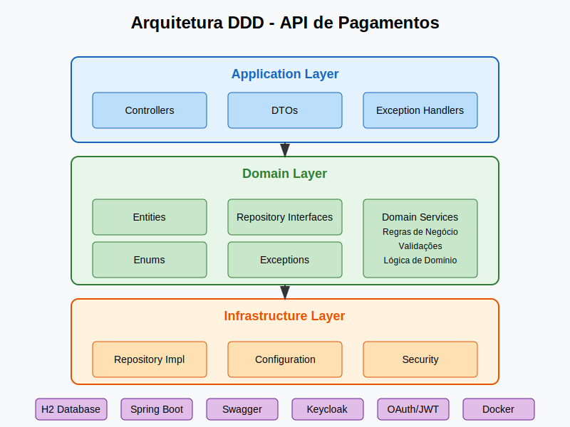

# API de Pagamentos

Este projeto implementa uma API de pagamentos utilizando Domain-Driven Design (DDD) para gerenciar o recebimento e processamento de pagamentos de débitos. A API permite criar, consultar, atualizar e inativar pagamentos, além de oferecer filtros de busca por diversos critérios.

## 📋 Índice

- [Arquitetura](#-arquitetura)
- [Tecnologias](#-tecnologias)
- [Deploy com Docker Compose](#-configuração-e-execução)
- [Segurança com Keycloak](#-segurança-com-keycloak)
- [Endpoints da API](#-endpoints-da-api)
- [Exemplos de Uso](#-exemplos-de-uso)
- [Documentação da API](#-documentação-da-api)
- [Testes](#-testes)
- [Regras de Negócio](#-regras-de-negócio)

## 🏗 Arquitetura

O projeto é estruturado seguindo os princípios do Domain-Driven Design (DDD), organizando o código em camadas bem definidas:

### Camadas da Arquitetura

1. **Domain Layer (Camada de Domínio)**:
   - Contém as entidades (`Pagamento`), enums (`MetodoPagamento`, `StatusPagamento`) e regras de negócio
   - Interfaces de repositório (`PagamentoRepository`)
   - Serviços de domínio (`PagamentoService`)

2. **Infrastructure Layer (Camada de Infraestrutura)**:
   - Implementação da persistência com JPA e H2
   - Configuração de beans para injeção de dependência
   - Implementação dos repositórios

3. **Application Layer (Camada de Aplicação)**:
   - Controllers REST para expor as APIs
   - DTOs para transferência de dados
   - Handler de exceções


## 🛠 Tecnologias

- **Java 17**: Linguagem de programação principal
- **Spring Boot 2.7.x**: Framework para criação de aplicações Java
- **Spring Data JPA**: Para acesso a dados com JPA
- **Spring Security**: Para a camada de segurança
- **Keycloak 19.0.1**: Para autenticação e autorização com OAuth 2.0/OpenID Connect
- **H2 Database**: Banco de dados em memória para desenvolvimento e testes
- **OpenAPI/Swagger**: Para documentação da API
- **Maven**: Para gerenciamento de dependências
- **JUnit 5**: Para testes automatizados
- **Docker**: Para conteinerização, especialmente do Keycloak

## 🚀 Configuração e Execução

### Pré-requisitos

- JDK 17
- Maven 3.6+
- Docker e Docker Compose (para Keycloak)

### Passos para Execução

🐳 Deploy com Docker Compose
Para implantar a API e o Keycloak usando Docker Compose, siga os passos abaixo:
Pré-requisitos

Docker instalado (versão 20.10 ou superior)
Docker Compose instalado (versão 2.0 ou superior)
Git (opcional, para clonar o repositório)

Arquivos Necessários
Certifique-se de ter os seguintes arquivos na raiz do seu projeto:
1. **docker-compose.yml**
2. **Dockerfile**
3. **keycloak/imports/pagamentos-realm.json**

Para implantar a API e o Keycloak usando Docker Compose, você pode utilizar os scripts de automação fornecidos ou seguir os passos manuais.

### Scripts de Automação

Para simplificar o processo de deploy, disponibilizamos scripts para ambientes Linux/macOS e Windows:

#### Para Linux/macOS:

1. **Torne o script executável**:
   ```bash
   chmod +x deploy.sh
   ```

2. **Execute o script**:
   ```bash
   ./deploy.sh
   ```

#### Para Windows:

1. **Execute o script**:
   ```
   deploy.bat
   ```

Estes scripts automatizam todo o processo de:
- Verificar pré-requisitos (Docker, Docker Compose)
- Compilar o projeto (se Maven estiver disponível)
- Criar a estrutura de diretórios necessária
- Verificar se todos os arquivos necessários estão presentes
- Iniciar os serviços com Docker Compose
- Verificar o status dos serviços

### Deploy Manual

1. **Compile a aplicação** (se ainda não tiver o JAR pronto):
   ```bash
   mvn clean package -DskipTests
   ```

2. **Crie a estrutura de diretórios para o Keycloak**:
   ```bash
   mkdir -p keycloak/imports/
   ```

3. **Salve o arquivo pagamentos-realm.json** na pasta `keycloak/imports/`

4. **Inicie os serviços com Docker Compose**:
   ```bash
   docker-compose up --build
   ```

   Ou para executar em segundo plano:
   ```bash
   docker-compose up -d --build
   ```

5. **Verifique se os serviços estão rodando**:
   ```bash
   docker-compose ps
   ```

6. **Acesse os serviços**:
   - API: http://localhost:8080
   - Swagger UI: http://localhost:8080/swagger-ui.html
   - Keycloak: http://localhost:8180

### Comandos Úteis

- **Parar os serviços**:
  ```bash
  docker-compose down
  ```

- **Ver logs dos serviços**:
  ```bash
  docker-compose logs
  ```

  Ou para um serviço específico:
  ```bash
  docker-compose logs keycloak
  docker-compose logs pagamentos-api
  ```

- **Reiniciar os serviços**:
  ```bash
  docker-compose restart
  ```


## 🔐 Segurança com Keycloak

A API utiliza Keycloak como servidor de autenticação e autorização baseado em OAuth 2.0 e OpenID Connect.

### Configuração do Keycloak

O Keycloak é iniciado via Docker Compose e pré-configurado com:
- Um realm chamado `pagamentos-realm`
- Um cliente chamado `pagamentos-api`
- Um papel (role) chamado `pagamento_admin`
- Um usuário de teste: `usuario1/password`

### Obtenção de Token de Acesso

Para interagir com a API, você precisa obter um token JWT:

```bash
curl -X POST http://localhost:8180/auth/realms/pagamentos-realm/protocol/openid-connect/token \
  --header 'Content-Type: application/x-www-form-urlencoded' \
  --data-urlencode 'grant_type=password' \
  --data-urlencode 'client_id=pagamentos-api' \
  --data-urlencode 'client_secret=YQwLiTeFMJEqY9JZx6W8RJ0tQlSAhiYQ' \
  --data-urlencode 'username=usuario1' \
  --data-urlencode 'password=password'
```

A resposta conterá o `access_token` que você usará para autenticar as requisições.

### Uso do Token nas Requisições

Em todas as chamadas à API, inclua o token no cabeçalho Authorization:

```bash
curl -X GET http://localhost:8080/api/pagamentos \
  --header 'Authorization: Bearer SEU_TOKEN_AQUI'
```

## 📡 Endpoints da API

A API expõe os seguintes endpoints:

| Método | Endpoint | Descrição |
|--------|----------|-----------|
| POST | /api/pagamentos | Criar um novo pagamento |
| PUT | /api/pagamentos/{id}/status | Atualizar o status de um pagamento |
| DELETE | /api/pagamentos/{id} | Inativar um pagamento (exclusão lógica) |
| GET | /api/pagamentos | Listar todos os pagamentos ativos |
| GET | /api/pagamentos/{id} | Buscar um pagamento específico por ID |
| GET | /api/pagamentos/filtro | Filtrar pagamentos por código de débito, CPF/CNPJ ou status |

## 📝 Exemplos de Uso

### Criar um Pagamento

```bash
curl -X POST http://localhost:8080/api/pagamentos \
  --header 'Authorization: Bearer SEU_TOKEN_AQUI' \
  --header 'Content-Type: application/json' \
  --data '{
    "codigoDebito": 123,
    "cpfCnpj": "12345678901",
    "metodoPagamento": "PIX",
    "valor": 100.00
  }'
```

### Criar um Pagamento com Cartão

```bash
curl -X POST http://localhost:8080/api/pagamentos \
  --header 'Authorization: Bearer SEU_TOKEN_AQUI' \
  --header 'Content-Type: application/json' \
  --data '{
    "codigoDebito": 456,
    "cpfCnpj": "98765432101",
    "metodoPagamento": "CARTAO_CREDITO",
    "numeroCartao": "1234567890123456",
    "valor": 200.00
  }'
```

### Atualizar Status de um Pagamento

```bash
curl -X PUT http://localhost:8080/api/pagamentos/1/status \
  --header 'Authorization: Bearer SEU_TOKEN_AQUI' \
  --header 'Content-Type: application/json' \
  --data '{
    "status": "PROCESSADO_SUCESSO"
  }'
```

### Listar Todos os Pagamentos

```bash
curl -X GET http://localhost:8080/api/pagamentos \
  --header 'Authorization: Bearer SEU_TOKEN_AQUI'
```

### Filtrar Pagamentos por Status

```bash
curl -X GET http://localhost:8080/api/pagamentos/filtro?status=PENDENTE_PROCESSAMENTO \
  --header 'Authorization: Bearer SEU_TOKEN_AQUI'
```

## 📚 Documentação da API

A documentação completa da API está disponível através do Swagger UI:

- **URL**: http://localhost:8080/swagger-ui.html

Para autenticar no Swagger UI:
1. Clique no botão "Authorize"
2. Insira seu token no formato: `Bearer SEU_TOKEN_AQUI`
3. Clique em "Authorize" e feche o diálogo
4. Agora você pode testar todos os endpoints diretamente pela interface

## 🧪 Testes

O projeto inclui testes unitários e de integração abrangentes.

### Executar Testes

```bash
# Executar todos os testes
mvn test

# Executar testes unitários apenas
mvn test -Dtest=Pagamento*Test,PagamentoService*Test

# Executar testes de integração apenas
mvn test -Dtest=*IntegrationTest
```

## 📋 Regras de Negócio

### Regras de Status

1. Quando um pagamento é criado, seu status inicial é sempre **PENDENTE_PROCESSAMENTO**.

2. Regras de transição de status:
   - De **PENDENTE_PROCESSAMENTO** para **PROCESSADO_SUCESSO** ou **PROCESSADO_FALHA**: ✅ Permitido
   - De **PROCESSADO_SUCESSO** para qualquer outro status: ❌ Não permitido
   - De **PROCESSADO_FALHA** para **PENDENTE_PROCESSAMENTO**: ✅ Permitido
   - De **PROCESSADO_FALHA** para **PROCESSADO_SUCESSO**: ❌ Não permitido

3. Exclusão lógica (inativação):
   - Somente pagamentos com status **PENDENTE_PROCESSAMENTO** podem ser inativados.
   - Pagamentos inativados não aparecem nas consultas.

### Métodos de Pagamento

- Para métodos de pagamento **CARTAO_CREDITO** ou **CARTAO_DEBITO**, o número do cartão é obrigatório.
- Para métodos **PIX** ou **BOLETO**, o número do cartão não é necessário.

---


## 📄 Licença

Este projeto está licenciado sob a licença MIT - veja o arquivo [LICENSE](LICENSE) para detalhes.

## ✍️ Autor

*Rafael Barros* - [github.com/rafaelbarros2](https://github.com/rafaelbarros2)

---

*Desenvolvido como parte de um desafio técnico para demonstrar habilidades em Spring Boot, arquitetura DDD e segurança com OAuth 2.0*

*Para mais informações sobre segurança e autenticação, consulte o arquivo KEYCLOAK.md*